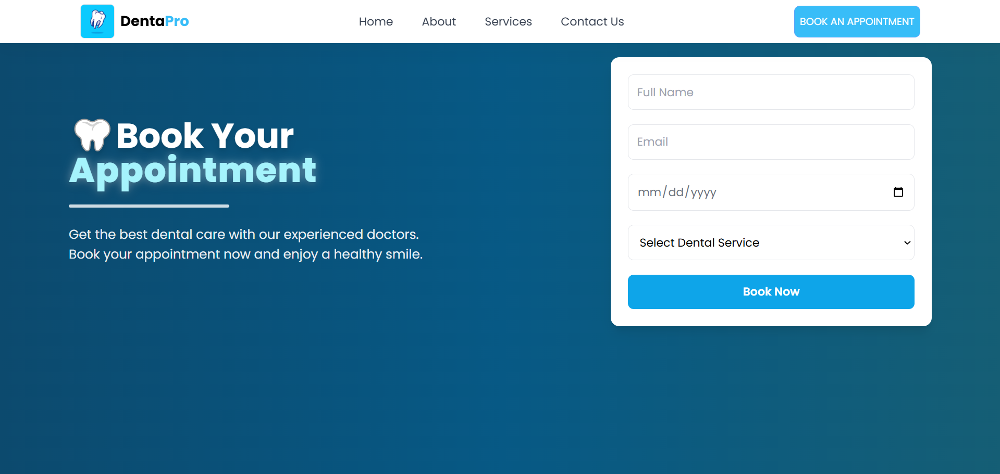
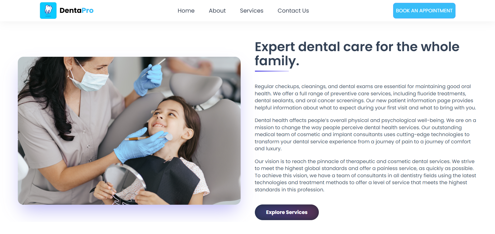
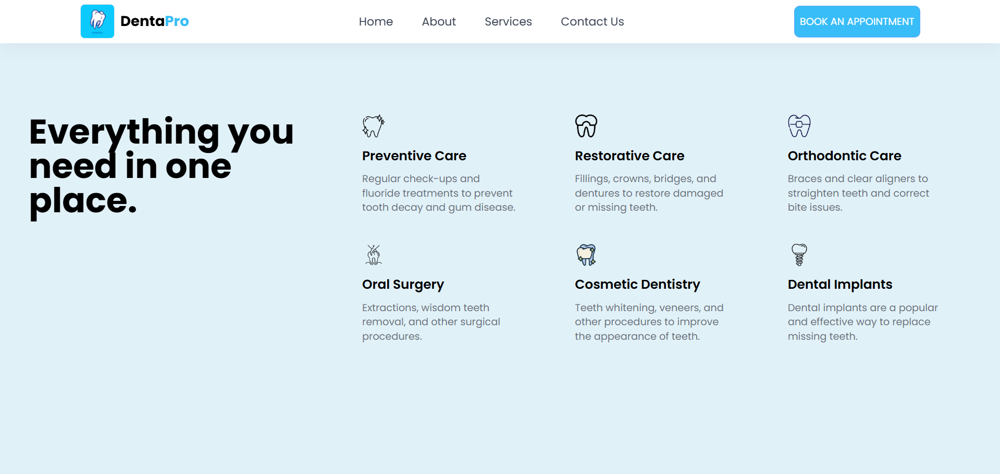

# 🦷 DentaPro - Dental Appointment System

A modern web application for a dental_clinc appointments easily and efficiently.  
Built using **React + Vite + Tailwind CSS + Firebase + Netlify**.

---

## 🚀 Live Demo
👉 https://dentaproo.netlify.app/

---

## 📸 Features

- 📅 Book dental appointments online
- 🧾 Real-time form submission
- ⚡ Fast and responsive UI
- 🔥 Firebase integration (Firestore database)
- 📱 Fully responsive design (mobile & desktop)
- 🌐 Deployed on Netlify

---
## 📸 Screenshots

<p align="center">
  
  
  
  
  
</p>
---
## 🛠️ Tech Stack

- React.js
- Vite
- Tailwind CSS
- Firebase (Firestore)
- Netlify (Hosting)

---

## 📂 Project Structure
```bash id="project_tree"
src/
├── components/
├── pages/
├── firebase/
├── App.jsx
├── main.jsx
```
---

## 🔥 Installation & Setup

Clone the repository:

```bash
git clone https://github.com/Y0ussef-elnagar/DentaPro_app.git
```
Install dependencies:
```
npm install
```
Run development server:
```
npm run dev
```
Build for production:
```
npm run build
```
---
⚙️ Firebase Setup:

Make sure to add your Firebase config inside:
```
firebase.js / firebaseConfig.js
```
---
## 🌐 Build & Deployment

To build the project for production:
```bash
npm run build
```
Deploy on GitHub Pages (after configuring vite.config.js base):
```bash
npm run deploy
```
---
👨‍💻 Author:
Developed by Youssef El-Nagar
